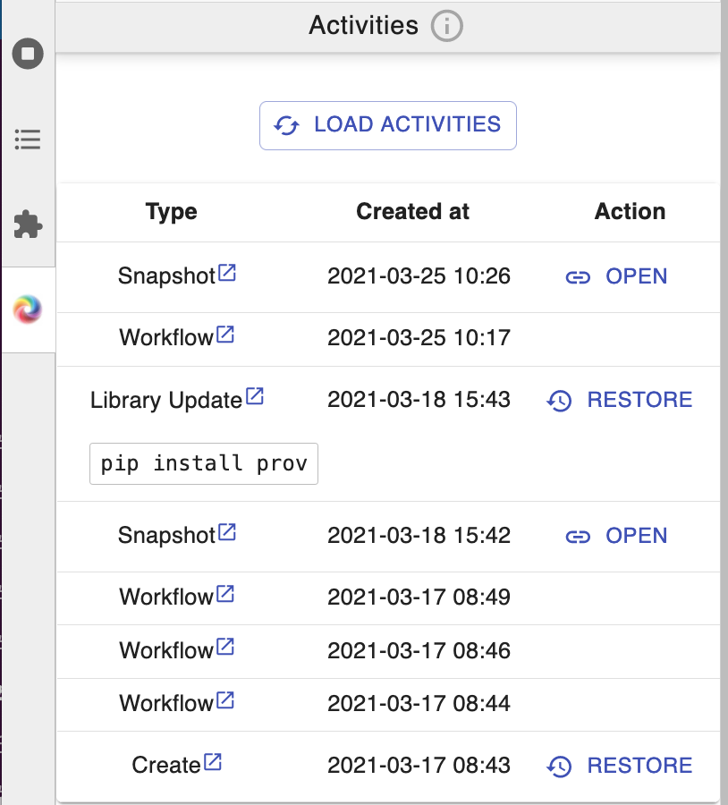

# Welcome to SWIRRL!

SWIRRL is a webservice API that allows websites, such as scientific data-dissemination portals, to integrate analysis tools and repurpose them to their users. By combining cloud storage, ***Workflows***, **Jupyter notebooks** and **GitHub** repositories, SWIRRL creates dedicated and reproducible working environments. 
In this short guide we explain how SWIRRL manages the data in your workspace and how you can control its functionalities via JupyterLab.

## The /data folder

Thanks to the API's native support for workflows that perform data-staging operations from remote providers, SWIRRL workspaces are populated with the data you are interested in. If you are reading this page, it is likely that you have already requested the website that provided you with this workspace to collect a set of data for you! 

SWIRRL manages the data staged to this workspace in the ***/data*** folder. To make sure that this folder is always consistent and your analysis reproducible, this is set as *'read only'*. However, you can always request to add more data.

### /data/latest

***Is the data that you have requested already available?*** 

Check your ***/data/latest*** folder! Here you will find the most updated version the data available for you to use.

Not there yet? Click on the SWIRRL Explorer 

In this handy control panel you can check whether there are workflows running in the background. For instance, one might be copying data to your workspace just now. 

You will read more about the functionalities of SWIRRL Explorer in this short guide!

### /data/staginghistory

Each time data is staged to your workspace, SWIRRL keeps track of the changes by maintaining a staging history. You will find this in the ***/data/staginghistory*** folder.

Here, each of the ***stage.nnnnn*** folders corresponds to the execution of a workflow in your workspace. SWIRRL creates them to persist the state of your data storage before the invocation of the next workflow. This will give you the opportuinity to always access previous versions of the input data. This would allow you to reproduce the analysis preformed on a file that has been updated by the execution of a more recent workflow.

***How to know whether a file has been updated?***

Once a file is added to your data storage, this will be always visible in your ***/data/latest/***. However that file could have been updated by a workflow. To check whether this had occurred, each ***stage.nnnn*** folder contains a ***swirrl_fileinfo.json***. Here you will find a complete record of metadata describing ***filename***, ***state***, ***id*** and ***sourceUrl*** of every file in that particular stage. The ***state*** property can tell you whether the file is *new*, ***updated***, or left *unchanged*.

**IMPORTANT NOTE!!:** The amount of storage available for you is regulated by the organisation running SWIRRL. SWIRRL provides information about the usage of the resources via its API, so that the organisation can tell you in advance whether you can add more data to your space, or if you can create a new Jupyter instance. Take into account that the best use of SWIRRL is to create workspaces that are built around a specific set of data. This best practice will make sure that the workspaces are focused on the particural research you are after, making them better understandable and shareable among peers.

## The SWIRRL Explorer

SWIRRL in combination with JupyterLab, allows you to customise your workspace, share and reproduce the progress of your analysis. You can update and install python libraries in your environtment or roll-back to a previous state. You can freeze and create snapshots of your notebook to a personal Github account, or to a repository managed by your project. 

You can control these actions via the SWIRRL Explorer. We keep records about their execution and list them interactively with detailed documentation. As shown in the screenshot below, workflow runs are also recorded and included in the list of activities. 

### Update and Restore Libraries

The installation and update of python libraries in a workspace can be performed programmatically, via the SWIRRL API, or manually by the users via the Jupyter terminal. The image above shows that the record of an ***Update Library*** activty displays a textual representation of the command invoked by the installation, eg. "*pip install prov*". 

Sometimes, changes to your environment could make it unstable or not suitable for your purposes. Typically, to recover, you would have to remember the changes and manually unistall or downgrade one or more libraries, with the risk of breaking software dependencies, thereby making the workspace unusuable. In SWIRRL these recovery actions can be easily performed by clicking on the ***Restore*** button, next to the ***Create*** or ***Update Libraries*** activity, which had generated the environment you want to return at.

SWIRRL always requests for confirmation by showing to users the *diff* between the current environment and the one to be restored. The image below shows an example.

**Note:** A ***Restore*** activity is also recorded and SWIRRL allows to recover to it.

### Snapshots

One  of  the  benefits of using Jupyter is that  both  analysis and results can be documented in the notebooks. However, to  make  sure that we can reproduce our findings and share them with others, who can evaluate them independently, the underlying software environment and the input data have to be distributed alongside the notebooks. SWIRRL automates this by offering a service that generates, on-demand, a reproducible snapshot of the whole workspace.

A snapshot is a special GitHub repository called ***Binder***. It includes the notebooks, the auxiliary files, the information about the software environment and the references to the input data in your ***/data*** folder. You can ask SWIRRL to push the repository directly to your GitHub account or, alternatively, to the default account associated with the project or institution running the SWIRRL API. 

Below we show how the *"tutorial-reanalysis"* snapshot is created via the SWIRRL Explorer.

***Binders*** can be shared and deployed in http://mybinder.org. SWIRRL adds to the binders the references to the data and means of access.  MyBinder will use this information to automatically download the data, preparing a consistent and executable copy of the workspace to be independently executed. 

**NOTE**: In a future release, we will implement the possibility of loading these ***Binders*** as a new SWIRRL workspace.

## Questions and Feedback!

Please contact us on swirrl-api@knmi.nl!